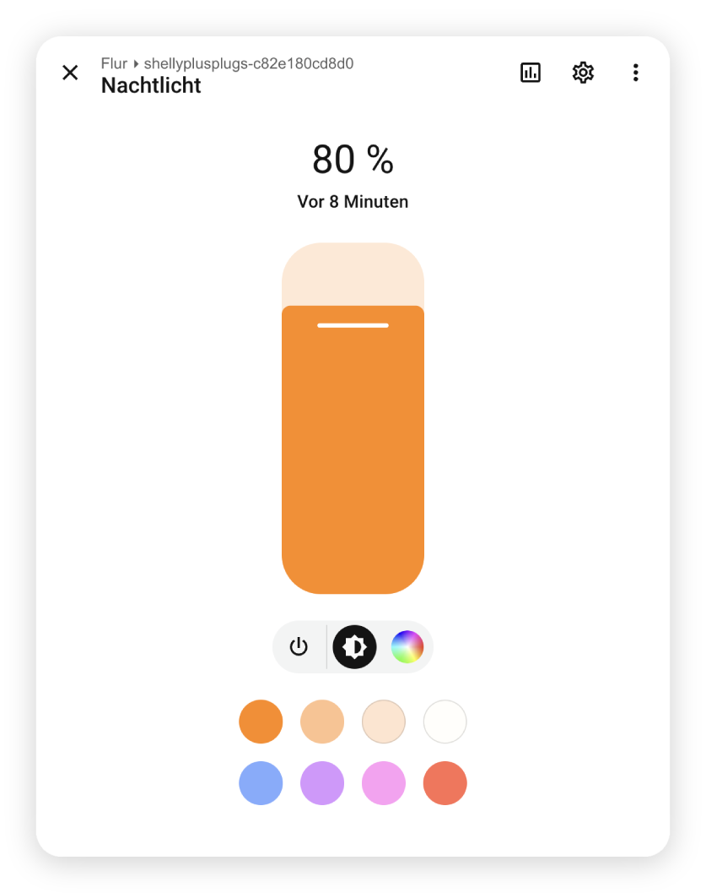

# Shelly Plug LED Ring Integration for Home Assistant

  

> This is a fork of the original **[shelly_plug_led](https://github.com/ishiharas/shelly_plug_led)** by **[@ishiharas](https://github.com/ishiharas)** — all credit for the original design and implementation goes to them. This fork adds **Shelly Power Strip (Gen4)** support on top of it.

A custom Home Assistant integration that turns the built-in RGB LED(s) of your **Shelly Plug S (Gen2 / Gen3)** or **Shelly Power Strip (Gen4)** devices into independent, fully controllable smart light entities.

This integration interacts with the LED configuration engine. It allows you to 
- change colors
- apply dimming levels
- toggle the LED(s) on and off 

**without affecting the operational on/off power state of the actual smart plug/outlet relay(s)**.

  

## Prerequisites
1. You must have your Shelly plug(s) or power strip already configured and active in Home Assistant via the **official built-in Shelly integration**.
2. Your hardware must be a Generation 2/3 local RPC plug (such as the standard Shelly Plus Plug S or newer variants) or a Generation 4 Shelly Power Strip.

## Multi-outlet devices (Shelly Power Strip)

On a Power Strip, one `LED Outlet N` light entity is created per physical outlet (`switch:0`..`switch:3`), each with its own independently controllable color and brightness. There's a firmware limitation to be aware of: the LED **mode** (off / power-tracking / static-color) is a single setting shared by all outlets, not per-outlet - so turning any one outlet's LED off switches the whole strip's LED mode off, and all outlet LEDs will show as off. Only the *color* is independent per outlet while the strip is in "switch" mode. The "Reset LEDs to Default" button likewise resets the whole device, not a single outlet.

---

## Installation

### Method 1: Via HACS (Recommended)
1. Open **HACS** in your Home Assistant sidebar.
2. Click the three dots `...` in the top-right corner and select **Custom repositories**.
3. Paste the URL of your GitHub repository into the *Repository* input.
4. Select **Integration** as the Category and click **Add**.
5. Find **Shelly Plug LED Ring** in the HACS interface and click **Download**.
6. **Restart Home Assistant Core** to load the custom workspace files.

### Method 2: Manual Installation
1. Download the project repository source archive.
2. Extract the archive and copy the folder `config/custom_components/shelly_plug_led` directly into your Home Assistant runtime directory.
3. **Restart Home Assistant Core**.

---

## Configuration

1. In Home Assistant, navigate to **Settings > Devices & Services**.
2. Click the **Add Integration** button in the bottom right corner.
3. Search for **Shelly Plug LED Ring** and select it.

---

## Credits

Originally created by **[@ishiharas](https://github.com/ishiharas)** — see the upstream project at [ishiharas/shelly_plug_led](https://github.com/ishiharas/shelly_plug_led). This fork ([@radioactive-bbs](https://github.com/radioactive-bbs)) builds on that work to add Shelly Power Strip (Gen4) multi-outlet support.
